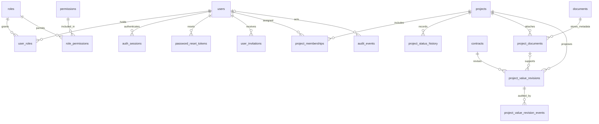
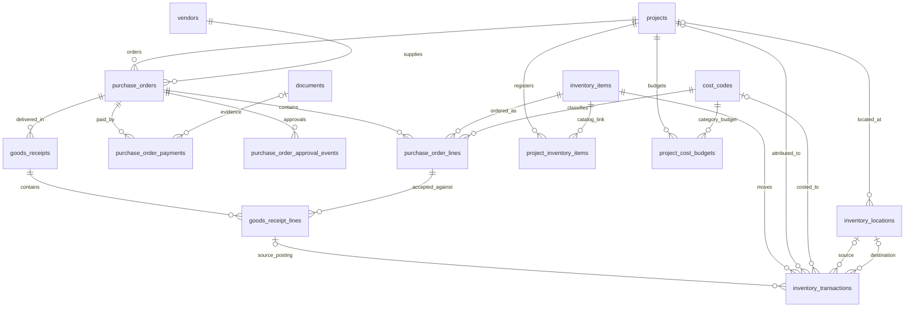
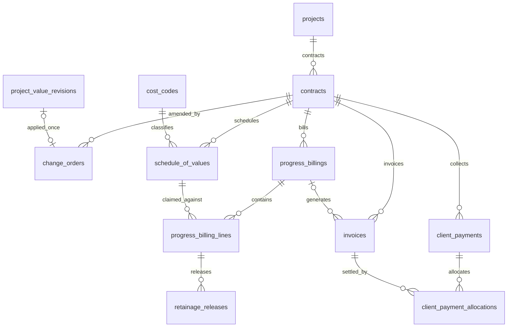
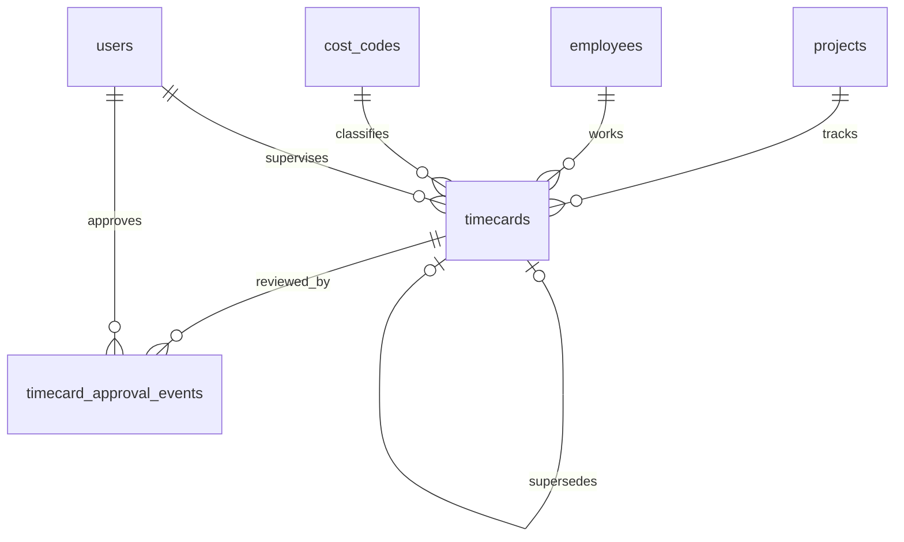

# Vridhi: PostgreSQL Entities and SQLAlchemy 2.x Mapping

## 1. Scope and Conventions

Production schema proposal for a single construction company, based on [construction-erp-plan.md](construction-erp-plan.md), Sections 5.5-5.7. This document specifies 41 entities; it does not create executable ORM models or database migrations. Multi-company SaaS requires organizations and tenant-scoped constraints.

Each entity entry lists its PostgreSQL table, SQLAlchemy class, primary key, all proposed foreign keys, other fields, and mapped relationships. Database column names and Python scalar attribute names are identical. Relationship attributes are ORM navigation properties, not additional database columns. All fields are required unless marked `?` (nullable). Optional relationships use nullable foreign keys and `Mapped[Target | None]`.

### Shared Field Mapping

| Type code | PostgreSQL | SQLAlchemy 2.x | Python mapped type |
|---|---|---|---|
| UUID | UUID | `Uuid(as_uuid=True)` | `Mapped[UUID]` |
| TEXT | TEXT | `Text` | `Mapped[str]` |
| BOOL | BOOLEAN | `Boolean` | `Mapped[bool]` |
| INT | INTEGER | `Integer` | `Mapped[int]` |
| BIGINT | BIGINT | `BigInteger` | `Mapped[int]` |
| MONEY | NUMERIC(18,2) | `Numeric(18, 2)` | `Mapped[Decimal]` |
| QTY | NUMERIC(18,4) | `Numeric(18, 4)` | `Mapped[Decimal]` |
| HOURS | NUMERIC(8,2) | `Numeric(8, 2)` | `Mapped[Decimal]` |
| RATE | NUMERIC(7,6) | `Numeric(7, 6)` | `Mapped[Decimal]` |
| DATE | DATE | `Date` | `Mapped[date]` |
| TS | TIMESTAMPTZ | `DateTime(timezone=True)` | `Mapped[datetime]` |
| JSON | JSONB | PostgreSQL `JSONB` | `Mapped[dict[str, Any]]` |
| CODE | TEXT with CHECK | `Text` with `CheckConstraint` | `Mapped[str]` |
| CURRENCY | VARCHAR(3) | `String(3)` | `Mapped[str]` |

`?` also adds `| None` to the Python type. Monetary values use Decimal, never float. Codes use defined allowed values rather than unconstrained status strings. Currency defaults to INR. Tokens contain only secure token hashes, never plaintext tokens.

Unless explicitly overridden, PK is `id: UUID`, generated by `uuid4`, mapped with `primary_key=True`. All FKs are UUID mapped with `ForeignKey("target_table.id", ondelete="RESTRICT")`. Mutable records also include `created_at: TS` and `updated_at: TS`; immutable records use their listed event timestamp instead. Entries identify their lifecycle below. Both shared timestamp fields are mapped columns, not ORM relationships.

## 2. Entity Catalog

### 2.1 Identity and Access

| Table / ORM model | Primary key | Foreign keys | Other fields | Mapped relationships / lifecycle |
|---|---|---|---|---|
| `users` / `User` | id: UUID | None | username: TEXT, email: TEXT, password_hash: TEXT?, password_algorithm: TEXT?, password_version: INT?, name: TEXT, active: BOOL, email_verified_at: TS? | role_grants, project_memberships, sessions, reset_tokens, invitations; mutable |
| `roles` / `Role` | id: UUID | None | code: CODE | user_grants, permission_links; mutable |
| `permissions` / `Permission` | id: UUID | None | code: TEXT, description: TEXT? | role_links; mutable |
| `user_roles` / `UserRole` | id: UUID | user_id -> users.id; role_id -> roles.id; granted_by_id -> users.id | granted_at: TS, revoked_at: TS? | user, role, grantor; grant lifecycle, no shared timestamps |
| `role_permissions` / `RolePermission` | (role_id, permission_id): UUID composite | role_id -> roles.id; permission_id -> permissions.id | None | role, permission; association, no shared timestamps |
| `auth_sessions` / `AuthSession` | id: UUID | user_id -> users.id | token_hash: TEXT, created_at: TS, expires_at: TS, revoked_at: TS? | user; session lifecycle, no updated_at |
| `password_reset_tokens` / `PasswordResetToken` | id: UUID | user_id -> users.id | token_hash: TEXT, created_at: TS, expires_at: TS, consumed_at: TS?, request_metadata: JSON | user; token lifecycle, no updated_at |
| `user_invitations` / `UserInvitation` | id: UUID | user_id -> users.id; invited_by_id -> users.id | token_hash: TEXT, created_at: TS, expires_at: TS, accepted_at: TS? | user, inviter; token lifecycle, no updated_at |

Username uniqueness uses a case-normalized stored value; email uniqueness uses the agreed normalization policy. Password hash and algorithm/version are populated together once the invited user sets a password. Partial unique indexes prevent duplicate active user/role grants where revoked_at IS NULL. RolePermission has no standalone id. Role codes: Owner, Managing Director, Admin, Supervisor, Cashier.

### 2.2 Projects, Documents, and Value History

| Table / ORM model | Primary key | Foreign keys | Other fields | Mapped relationships / lifecycle |
|---|---|---|---|---|
| `projects` / `Project` | id: UUID | created_by_id -> users.id | name: TEXT, location: TEXT, status: CODE, baseline_budget: MONEY, currency: CURRENCY, start_date: DATE, estimated_end_date: DATE? | creator, memberships, status_history, documents, value_revisions, purchase_orders, inventory_item_links, locations, cost_budgets, contracts, timecards, inventory_transactions; mutable |
| `project_memberships` / `ProjectMembership` | id: UUID | project_id -> projects.id; user_id -> users.id; granted_by_id -> users.id | granted_at: TS, revoked_at: TS? | project, user, grantor; grant lifecycle, no shared timestamps |
| `project_status_history` / `ProjectStatusHistory` | id: UUID | project_id -> projects.id; actor_id -> users.id | previous_status: CODE, new_status: CODE, comment: TEXT, hold_reason: TEXT?, completion_note: TEXT?, occurred_at: TS | project, actor; immutable |
| `documents` / `Document` | id: UUID | uploaded_by_id -> users.id | object_key: TEXT, filename: TEXT, mime_type: TEXT, byte_size: BIGINT, checksum: TEXT, uploaded_at: TS | uploader, project_links, vendor_payment_receipts; immutable metadata |
| `project_documents` / `ProjectDocument` | id: UUID | project_id -> projects.id; document_id -> documents.id; deleted_by_id? -> users.id | category: CODE, comment: TEXT, deleted_at: TS?, deletion_reason: TEXT? | project, document, deleted_by, value_revisions; mutable |
| `project_value_revisions` / `ProjectValueRevision` | id: UUID | project_id -> projects.id; contract_id -> contracts.id; source_project_document_id? -> project_documents.id; proposed_by_id -> users.id | previous_value: MONEY, proposed_value: MONEY, effective_date: DATE, approval_status: CODE | project, contract, source_document, proposer, events, change_order; mutable proposal, immutable events |
| `project_value_revision_events` / `ProjectValueRevisionEvent` | id: UUID | revision_id -> project_value_revisions.id; actor_id -> users.id | action: CODE, occurred_at: TS, comment: TEXT | revision, actor; immutable |

Project status: Planning, Active, On Hold, Completed. Document category: initial_approval or revised_plan. Approval status: pending, approved, rejected. A revised-plan proposal requires a source document; other authorized proposal channels may leave it null. Require comments on status changes and hold reasons for On Hold. Active memberships are unique by project/user where revoked_at IS NULL. Document bytes live in private object storage, not PostgreSQL.

### 2.3 Procurement and Inventory

| Table / ORM model | Primary key | Foreign keys | Other fields | Mapped relationships / lifecycle |
|---|---|---|---|---|
| `vendors` / `Vendor` | id: UUID | None | name: TEXT, email: TEXT?, phone: TEXT?, address: TEXT?, tax_identifier: TEXT?, active: BOOL | purchase_orders; mutable |
| `inventory_items` / `InventoryItem` | id: UUID | None | sku: TEXT, name: TEXT, category: TEXT, unit_of_measure: TEXT, active: BOOL | project_links, purchase_lines, transactions; mutable |
| `project_inventory_items` / `ProjectInventoryItem` | id: UUID | project_id -> projects.id; item_id -> inventory_items.id | None beyond shared timestamps | project, item; mutable association |
| `purchase_orders` / `PurchaseOrder` | id: UUID | project_id -> projects.id; vendor_id -> vendors.id; created_by_id -> users.id | number: TEXT, order_date: DATE, currency: CURRENCY, approval_status: CODE | project, vendor, creator, lines, payments, receipts, approval_events; mutable until settled |
| `purchase_order_lines` / `PurchaseOrderLine` | id: UUID | purchase_order_id -> purchase_orders.id; item_id -> inventory_items.id; cost_code_id -> cost_codes.id | quantity: QTY, unit_price: MONEY, description: TEXT | purchase_order, item, cost_code, receipt_lines; mutable until settled |
| `purchase_order_approval_events` / `PurchaseOrderApprovalEvent` | id: UUID | purchase_order_id -> purchase_orders.id; actor_id -> users.id | action: CODE, occurred_at: TS, comment: TEXT | purchase_order, actor; immutable |
| `purchase_order_payments` / `PurchaseOrderPayment` | id: UUID | purchase_order_id -> purchase_orders.id; receipt_document_id? -> documents.id; recorded_by_id -> users.id; reversal_of_id? -> purchase_order_payments.id | amount: MONEY, payment_date: DATE, reference: TEXT?, comment: TEXT?, recorded_at: TS | purchase_order, receipt_document, recorded_by, original_payment, reversal; immutable |
| `goods_receipts` / `GoodsReceipt` | id: UUID | purchase_order_id -> purchase_orders.id; received_by_id -> users.id | received_at: TS, delivery_reference: TEXT? | purchase_order, receiver, lines; immutable once posted |
| `goods_receipt_lines` / `GoodsReceiptLine` | id: UUID | receipt_id -> goods_receipts.id; purchase_order_line_id -> purchase_order_lines.id | quantity_accepted: QTY | receipt, purchase_order_line, inventory_transactions; immutable once posted |
| `inventory_locations` / `InventoryLocation` | id: UUID | project_id? -> projects.id | name: TEXT | project, incoming_transactions, outgoing_transactions; mutable |
| `inventory_transactions` / `InventoryTransaction` | id: UUID | item_id -> inventory_items.id; project_id? -> projects.id; cost_code_id? -> cost_codes.id; source_location_id? -> inventory_locations.id; destination_location_id? -> inventory_locations.id; receipt_line_id? -> goods_receipt_lines.id; actor_id -> users.id; reversal_of_id? -> inventory_transactions.id | type: CODE, quantity: QTY, unit_cost: MONEY, occurred_at: TS | item, project, cost_code, source_location, destination_location, receipt_line, actor, original_transaction, reversal; immutable |
| `cost_codes` / `CostCode` | id: UUID | None | code: TEXT, name: TEXT, category: TEXT, active: BOOL | project_budgets, purchase_lines, transactions, schedule_lines, timecards; mutable |
| `project_cost_budgets` / `ProjectCostBudget` | id: UUID | project_id -> projects.id; cost_code_id -> cost_codes.id | budget_amount: MONEY | project, cost_code; mutable |

Unique keys: vendor/item master IDs are UUIDs; inventory_items.sku, cost_codes.code, and purchase_orders.number are unique. ProjectInventoryItem is unique by project_id/item_id; ProjectCostBudget by project_id/cost_code_id.

Inventory type codes: receipt, allocation, issue, transfer, return, reversal. Require at least one location; require distinct source/destination for transfers and allocations. A receipt has a destination, an issue has a source. Project and cost code are required for project-attributed consumption, but may be null for central-warehouse movements. Reversals reference their original and invert its ledger effect. Define return destinations and valuation with finance before implementation.

PO creation transactionally upserts each project/item link. Multiple orders of cement reuse the same catalog item; PO lines still identify each order independently. No ordered quantity is copied into received stock. Service or rental catalog items can be procured but must not be posted as physical stock receipts.

### 2.4 Contracts, Billing, and Client Payments

| Table / ORM model | Primary key | Foreign keys | Other fields | Mapped relationships / lifecycle |
|---|---|---|---|---|
| `contracts` / `Contract` | id: UUID | project_id -> projects.id | number: TEXT, original_value: MONEY, currency: CURRENCY, retainage_rate: RATE | project, value_revisions, change_orders, schedule_of_values, billings, invoices, client_payments; mutable commercial metadata |
| `change_orders` / `ChangeOrder` | id: UUID | contract_id -> contracts.id; value_revision_id? -> project_value_revisions.id; approved_by_id? -> users.id | amount_delta: MONEY, status: CODE, approved_at: TS? | contract, value_revision, approver; mutable approval workflow |
| `schedule_of_values` / `ScheduleOfValue` | id: UUID | contract_id -> contracts.id; cost_code_id -> cost_codes.id | description: TEXT, scheduled_amount: MONEY | contract, cost_code, billing_lines; mutable until billed |
| `progress_billings` / `ProgressBilling` | id: UUID | contract_id -> contracts.id | period_start: DATE, period_end: DATE, status: CODE, submitted_at: TS? | contract, lines, invoices; mutable approval workflow |
| `progress_billing_lines` / `ProgressBillingLine` | id: UUID | billing_id -> progress_billings.id; schedule_of_value_id -> schedule_of_values.id | current_work_amount: MONEY, retainage_amount: MONEY | billing, schedule_line, retainage_releases; mutable until posted |
| `invoices` / `Invoice` | id: UUID | contract_id -> contracts.id; progress_billing_id? -> progress_billings.id | number: TEXT, issued_date: DATE, due_date: DATE, total: MONEY | contract, billing, payment_allocations; immutable once issued |
| `client_payments` / `ClientPayment` | id: UUID | contract_id -> contracts.id; recorded_by_id -> users.id; reversal_of_id? -> client_payments.id | amount: MONEY, payment_date: DATE, reference: TEXT?, recorded_at: TS | contract, recorded_by, allocations, original_payment, reversal; immutable |
| `client_payment_allocations` / `ClientPaymentAllocation` | id: UUID | payment_id -> client_payments.id; invoice_id -> invoices.id | amount: MONEY, allocated_at: TS | payment, invoice; immutable posting |
| `retainage_releases` / `RetainageRelease` | id: UUID | billing_line_id -> progress_billing_lines.id; approved_by_id -> users.id | amount: MONEY, released_at: TS | billing_line, approver; immutable |

Contract and invoice numbers are unique. A nullable value_revision_id is unique when populated, so a revision produces at most one change order. Approved change orders require approved_by_id and approved_at. Negative change-order deltas are permitted; resulting approved contract value cannot be negative. A revision's previous/proposed values and its contract must use the same currency.

Invoices not generated by progress billing may have a null billing reference. Amounts allocated to an invoice cannot exceed its outstanding balance; allocations cannot exceed the payment amount. Reversed client payments must reverse their financial allocation effect without deleting original allocation records. Define credit-note, invoice-correction, and retainage-release-to-invoice workflows before implementing full accounting; these 41 entities are not a general ledger.

### 2.5 Attendance and Audit

| Table / ORM model | Primary key | Foreign keys | Other fields | Mapped relationships / lifecycle |
|---|---|---|---|---|
| `employees` / `Employee` | id: UUID | None | employee_number: TEXT, name: TEXT, default_hourly_rate: MONEY, active: BOOL | timecards; mutable |
| `timecards` / `Timecard` | id: UUID | project_id -> projects.id; employee_id -> employees.id; cost_code_id -> cost_codes.id; supervisor_id -> users.id; supersedes_id? -> timecards.id | work_date: DATE, regular_hours: HOURS, overtime_hours: HOURS, captured_regular_rate: MONEY?, captured_overtime_rate: MONEY?, status: CODE | project, employee, cost_code, supervisor, original_timecard, replacement, approval_events; mutable until approved |
| `timecard_approval_events` / `TimecardApprovalEvent` | id: UUID | timecard_id -> timecards.id; actor_id -> users.id | action: CODE, occurred_at: TS, comment: TEXT | timecard, actor; immutable |
| `audit_events` / `AuditEvent` | id: UUID | actor_id? -> users.id | action: TEXT, entity_type: TEXT, entity_id: UUID?, before: JSON?, after: JSON?, request_id: TEXT?, occurred_at: TS | actor; immutable |

Employee numbers are unique. Approval requires captured rates; pending entries may leave them null. Approved corrections create a replacement with unique supersedes_id and new approval events. Reports exclude superseded records. Audit actor can be null for automated/unauthenticated actions. Audit entity_id is a polymorphic identifier, not a database FK; entity_type and service validation establish its meaning.

## 3. ORM Relationship Implementation

Use `DeclarativeBase`, `Mapped[...]`, `mapped_column(...)`, and `relationship(back_populates=...)`. Collections use `Mapped[list[Child]]`; required parents use `Mapped[Parent]`. Association models retain grant timestamps and allocation amounts; use association proxies for convenient User.roles or Project.inventory_items navigation rather than a second competing writable relationship.

| Parent collection | Child scalar / back_populates | Cardinality |
|---|---|---|
| User.role_grants / Role.user_grants | UserRole.user / UserRole.role | Each 1:N; User to Role N:M |
| Role.permission_links / Permission.role_links | RolePermission.role / RolePermission.permission | Each 1:N; Role to Permission N:M |
| User.project_memberships / Project.memberships | ProjectMembership.user / ProjectMembership.project | Each 1:N; User to Project N:M |
| User.sessions / reset_tokens / invitations | AuthSession.user / PasswordResetToken.user / UserInvitation.user | 1:N |
| Project.status_history / documents / value_revisions | ProjectStatusHistory.project / ProjectDocument.project / ProjectValueRevision.project | 1:N |
| Document.project_links / vendor_payment_receipts | ProjectDocument.document / PurchaseOrderPayment.receipt_document | 1:N |
| ProjectValueRevision.events | ProjectValueRevisionEvent.revision | 1:N |
| Project.purchase_orders / Vendor.purchase_orders | PurchaseOrder.project / PurchaseOrder.vendor | 1:N |
| PurchaseOrder.lines / payments / receipts / approval_events | Corresponding child.purchase_order | 1:N |
| GoodsReceipt.lines / PurchaseOrderLine.receipt_lines | GoodsReceiptLine.receipt / GoodsReceiptLine.purchase_order_line | 1:N |
| GoodsReceiptLine.inventory_transactions | InventoryTransaction.receipt_line | 1:N, constrained source posting |
| Project.inventory_item_links / InventoryItem.project_links | ProjectInventoryItem.project / ProjectInventoryItem.item | Each 1:N; Project to Item N:M |
| InventoryItem.purchase_lines / transactions | PurchaseOrderLine.item / InventoryTransaction.item | 1:N |
| InventoryLocation.incoming_transactions / outgoing_transactions | InventoryTransaction.destination_location / source_location | 1:N |
| Project.contracts / cost_budgets / locations / timecards / inventory_transactions | Corresponding child.project | 1:N |
| CostCode.project_budgets / purchase_lines / transactions / schedule_lines / timecards | Corresponding child.cost_code | 1:N |
| Contract.value_revisions / change_orders / schedule_of_values / billings / invoices / client_payments | Corresponding child.contract | 1:N |
| ProjectDocument.value_revisions | ProjectValueRevision.source_document | 1:N |
| ProjectValueRevision.change_order | ChangeOrder.value_revision | 1:0..1, unique FK; uselist=False |
| ProgressBilling.lines / ScheduleOfValue.billing_lines | ProgressBillingLine.billing / schedule_line | 1:N |
| ProgressBilling.invoices | Invoice.billing | 1:N |
| ClientPayment.allocations / Invoice.payment_allocations | ClientPaymentAllocation.payment / invoice | Each 1:N; Payment to Invoice N:M |
| ProgressBillingLine.retainage_releases | RetainageRelease.billing_line | 1:N |
| Employee.timecards / Timecard.approval_events | Timecard.employee / TimecardApprovalEvent.timecard | 1:N |

Actor relations such as grantor, uploader, supervisor, and approver reference User independently; they do not imply the actor is the business owner of the record. These scalar relations need not all have reverse collections on User. Use explicit `foreign_keys` for every ambiguous User or InventoryLocation reference. Self-referential original/reversal and original/replacement relations need explicit `foreign_keys`, `remote_side`, and uniqueness on populated reversal_of_id/supersedes_id. Prevent cycles and reversing a reversal in the transactional service.

## 4. Visual Schema Mapping

Mermaid ER diagrams show table names and parent-to-child cardinalities. `||` means exactly one; `o|` zero or one; `o{` zero or many. For example, an optional source document uses `o|` on its side. Domain diagrams cover all 41 tables, emphasizing business relations; actor FKs and self-references are fully listed in Section 2 instead of repeated in each diagram.

### 4.1 Identity, Projects, Documents, and Audit

### 4.2 Procurement and Inventory

### 4.3 Contracts, Billing, and Collections

### 4.4 Attendance

## 5. Derived Fields and UI Mapping

These are query/service properties or read-only ORM expressions, not separately writable columns.

| UI / computed field | Schema source / mapping |
|---|---|
| Procurement Item | PurchaseOrderLine.item -> InventoryItem.name; line.description preserves ordered description |
| Vendor | PurchaseOrder.vendor -> Vendor.name |
| PO total | Sum of rounded line.quantity * line.unit_price; taxes/discounts require additional agreed modeling |
| Paid-to-date | Sum of original PurchaseOrderPayment amounts minus their reversals |
| Balance | max(0, PO total - paid-to-date) |
| Payment status | Pending if paid=0 and balance>0; Partially paid if paid>0 and balance>0; Paid if balance=0 |
| Edit / Add Payment enabled | balance>0; enforce the same restrictions server-side |
| Ordered / open quantity | PO lines in eligible lifecycle states / less accepted receipts, grouped by project and item |
| Received / available / consumed | InventoryTransaction type, quantity, location, and reversal effect; no stock created by payment |
| Current approved contract value | Contract.original_value + approved ChangeOrder.amount_delta |
| Project value history | ProjectValueRevision + events + source ProjectDocument + Document |
| Labor cost | Approved nonsuperseded Timecard hours multiplied by captured rates |
| Invoice paid balance | Net ClientPaymentAllocation amounts after payment reversal effects |

Procurement lists sort order_date descending without payment-state grouping. Paginated APIs use order_date DESC, id DESC for deterministic ordering across pages; UI sorting must not disguise unsorted page boundaries. Multi-line orders return a lines collection or explicitly labeled summary, not an arbitrary single item.

## 6. Integrity and Transaction Rules

- Use Alembic migrations and async SQLAlchemy transaction scopes. No cascade deletion of financial records, posted stock movements, audit events, or approval history. Deactivate masters and users; soft-delete project document associations while retaining referenced metadata.
- Enforce positive quantities/payment amounts, nonnegative prices/budgets/hours, valid date ranges, and retainage rate in [0,1]. Change-order deltas may be negative. Optional deletion/approval timestamps and actors must be populated consistently.
- All writes verify authenticated actor permissions and project membership. A foreign key alone does not prove same-project scope. Use composite scope keys where feasible and transactional checks for receipts, item identity, contract revisions, billing lines, and allocations.
- Lock the purchase order row for payment/reversal/edit operations. Reject overpayment, edits when balance is zero, and totals below net paid. Invoice allocation and retainage-release limits also require locks and cross-row aggregate checks.
- Register project/item links by unique-pair upsert inside PO creation. Receipt posting validates accepted quantity and item against the source PO line. Use a unique source-posting/idempotency key to prevent duplicate receipt postings; reversals must remain distinguishable from the original posting.
- Inventory movements require location and valuation rules, agreed with finance. Restrict issue quantities to available stock under an appropriate concurrency strategy. Open PO commitments never become actual material cost merely because they were ordered or paid.
- Reversals are append-only, reference an original in the same scope, and subtract its effect; prohibit double reversals and cycles. Positive amounts on reversals are not additional receipts/payments. Project value approval locks the contract, validates the proposal baseline, and creates at most one approved change order.
- Index foreign keys and common filters: purchase_orders(project_id, order_date, id), purchase_order_payments(purchase_order_id, payment_date), inventory_transactions(project_id, item_id, occurred_at), timecards(project_id, work_date, employee_id), and project_documents(project_id, created_at).
- Aggregate ledgers independently before joining reporting queries to avoid multiplying monetary totals. Dashboard/materialized views remain derived outputs, with explicit as-of time and refresh policy.

## 7. Implementation Boundaries

This is an entity/relationship blueprint, not deployed tables. Before code generation, finalize inventory valuation, approval thresholds, commercial tax/credit-note rules, service/rental classification, invoice adjustments, retainage invoicing, and document retention. Use explicit supplementary entities if these workflows require them rather than overloading payment or inventory records. The initial scope does not include a client master, general-ledger accounts/journals, multi-company tenancy, or native mobile synchronization.