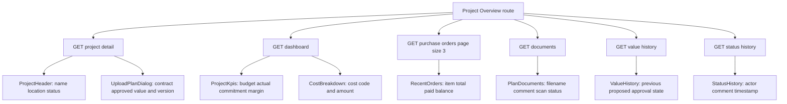
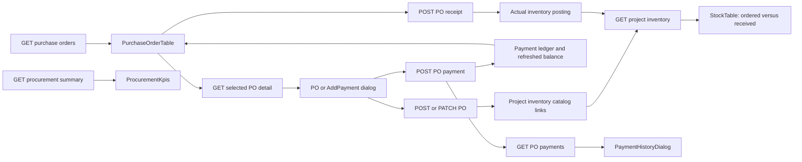
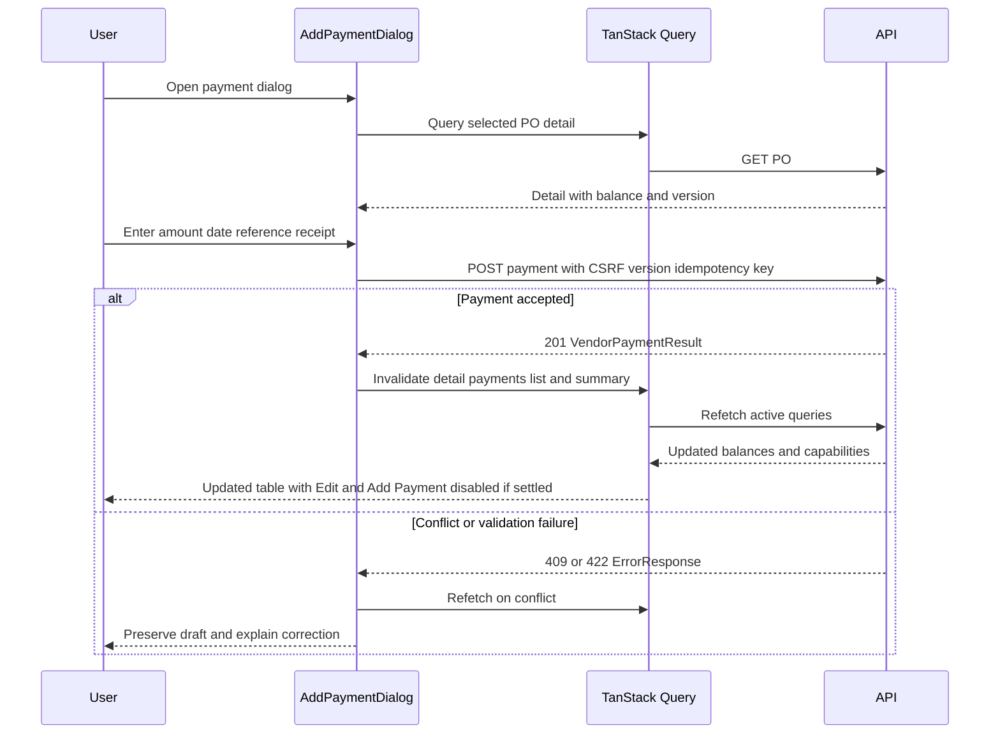
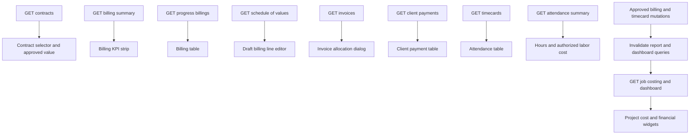

# Vridhi: React UI and API Mapping

## 1. Scope and Technology

Frontend: React SPA, Vite, Tailwind CSS, and TanStack Query v5. This is a production implementation guide based on [construction-erp-api-contracts.md](construction-erp-api-contracts.md). It does not change the standalone HTML prototype or scaffold a React app. The API contract remains authoritative for request validation, DTO definitions, access control, and HTTP statuses.

Every mapping below identifies the UI region/component, API, response fields to bind, and load trigger. Backend routes are prefixed with `/api/v1`; `P` means `/projects/{project_id}`, `PO` means `P/purchase-orders/{po_id}`, and `C` means `P/contracts/{contract_id}`. These are documentation aliases, not literal URLs. React component names are proposed names, not existing files. Screens marked planned need implementation beyond the current prototype.

## 2. Frontend Responsibilities

| Layer | Responsibility |
|---|---|
| Vite | Build/dev tooling; `VITE_API_BASE_URL` is public configuration, never a secret; dev proxy must preserve cookie/CSRF behavior |
| React routing | Select screen, project, contract and item; route guards prevent displaying unauthorized pages but never replace server checks |
| API client | Typed fetch requests, credentials included, CSRF header on writes, AbortSignal, FormData uploads, normalized ErrorResponse |
| TanStack Query | Server data, caching, loading/error states, dependent queries, mutation lifecycle and invalidation |
| React local state | Dialog open state, unsaved fields, selected rows, file selection; do not duplicate fetched ledgers in a second state store |
| URL search parameters | Shareable filters, date range and pagination; changing filters resets page to 1 |
| Tailwind CSS | Responsive layout, table overflow, state styling, focus and accessibility; does not fetch or transform domain data |
| DTO/view-model adapters | Select named fields, format dates/currency/units, preserve null/redacted fields; never invent financial totals |

Use a routing library such as React Router for the proposed route map; router choice is an additional dependency, not provided by Vite. Generate TypeScript DTOs from the eventual OpenAPI schema. Decimal strings stay strings/Decimal-compatible values until presentation; do not use binary float math for financial previews. Draft quantity x price previews are advisory and replaced by server totals.

## 3. Routes and Screen Composition

| SPA route | Screen / major components | Scope |
|---|---|---|
| /login | LoginForm | Public |
| /password-reset | ResetRequestForm / ResetCompleteForm | Public; token removed from URL after completion; never logged |
| /invitations/accept | InvitationAcceptForm | Public, planned |
| /projects | ProjectPortfolio, PortfolioKpiStrip, ProjectGrid | Authorized portfolio |
| /projects/:projectId/overview | ProjectHeader, ProjectKpis, CostBreakdown, RecentOrders, PlanDocuments, ValueHistory, StatusHistory | Selected project |
| /projects/:projectId/procurement | ProcurementKpis, PurchaseOrderTable, PO/Payment dialogs | Selected project |
| /projects/:projectId/inventory | InventoryKpis, StockTable, ItemDrawer, Receipt/Movement dialogs | Selected project; posting dialogs planned |
| /projects/:projectId/billing | ContractSelector, BillingKpis, BillingTable, Invoice/Collection tabs | Selected project; detailed workflows planned |
| /projects/:projectId/attendance | AttendanceKpis, TimecardTable, TimecardDialog | Selected project |
| /users | UserTable, UserDialog, MembershipDialog | Manageable users |
| /account | AccountProfile, SessionList, ChangePasswordForm | Own account, planned |
| /catalogs/:resource | MasterTable and MasterDialog | Authorized reference master, planned |
| /projects/:projectId/approvals | Value/PO/Billing/Timecard approval detail drawers | Planned; approvals opened from existing domain lists, no uncontracted generic approval API |
| /reports | PortfolioReport / JobCostReport | Planned, scoped |
| /audit | AuditTable, AuditDetail | Planned, permission-gated |

AppShell owns the profile menu, module navigation and project switcher. ProjectLayout owns ProjectHeader and project-level permissions. Page widgets own their individual queries so one history failure does not blank the entire page.

## 4. Component-to-API Field Mapping

### 4.1 Authentication and Shared Shell

| UI region / component | API -> response | Fields bound to UI | Load / action |
|---|---|---|---|
| LoginForm bootstrap | GET /auth/bootstrap -> AuthBootstrap | csrf_token held in API-client security state, not displayed | Before login POST |
| LoginForm submit | POST /auth/login -> AuthenticatedSession | user seeds current-user query; expires_at session notice; csrf_token for future writes | Submit credentials; navigate to /projects |
| AppShell profile/navigation | GET /me -> Me | name, username, role_codes; capabilities gate modules; company_wide_read controls portfolio scope | After authentication/on refresh |
| ProjectSwitcher | GET /me/projects -> Page<ProjectSummary> | items[].id/name/status; page/total for searchable paginated selection | Authenticated shell; search loads server matches, not only cached page |
| Logout button | POST /auth/logout -> 204 | No response fields | Clear all protected queries and drafts; navigate Login |
| ResetRequestForm | POST reset request -> Message | message as neutral confirmation | Submit identity; same UI for known/unknown accounts |
| ResetCompleteForm / InvitationAcceptForm | POST complete/accept -> Message | message as completion state | Submit token/new password; return Login |

GET /me failing with 401 is the unauthenticated bootstrap path. Do not load project queries until identity is resolved. Login seeds Me but does not grant permissions inferred from username or role text alone.

### 4.2 All Projects and Create Project

| UI region / component | API -> response | Fields bound to UI | Load / action |
|---|---|---|---|
| ProjectGrid / ProjectCard | GET /me/projects -> Page<ProjectSummary> | id route link, name title, location, status badge, baseline_budget, approved_contract_value?, currency, pending_proposal_count | Search/status/page change |
| PortfolioKpiStrip | GET /reports/portfolio -> PortfolioReport | project_count, counts_by_status, totals_by_currency[].budget/approved_contract_value/actual_cost/open_commitments; as_of | Same search/status scope as grid, not current page only |
| ProjectPagination | Project page envelope | total, page, page_size | Grid response; do not use items.length as total |
| CreateProjectDialog | POST /projects -> ProjectDetail | Returned id routes to Overview; contracts[].id/version used for optional initial file | Save name/location/budget/start date/initial contract value |
| InitialPlanUpload | POST P/documents -> DocumentUploadResult | document.filename/scan_status; no revised proposal needed for initial_approval | After project creation; retry upload without recreating project |

Capabilities on ProjectSummary gate row actions. A missing approved_contract_value means hidden/unavailable, not zero. Multiple currency totals render separate currency groups; do not combine them into one INR figure.

### 4.3 Project Overview

| UI region / component | API -> response | Fields bound to UI | Load / action |
|---|---|---|---|
| ProjectHeader | GET P -> ProjectDetail | name, location, status, current_status_note?, start_date, estimated_end_date?, capabilities | Project route entry; shared across modules |
| ProjectKpis | GET P/dashboard -> ProjectDashboard | budget?, approved_contract_value?, actual_cost?, open_commitments?, invoiced_amount?, cash_received?, forecast_cost?, margin_percent?; currency/as_of | Overview entry/as_of change |
| CostBreakdown | Dashboard DTO | cost_breakdown[].cost_code_id/amount | Same dashboard query; cost-code labels from authorized catalog if available |
| RecentOrders | GET P/purchase-orders?page_size=3 -> Page<PurchaseOrderSummary> | number, vendor.name, item_names, order_date, total, paid_to_date, balance, payment_status | Overview entry; order date newest first |
| PlanDocuments | GET P/documents -> Page<ProjectDocument> | filename, category, comment, uploaded_at, uploader.name, scan_status, can_delete | Overview entry; paginate/lazy-load older documents |
| Document open/download | GET P/documents/{id}/content -> DownloadLink | url action, filename; expires_at | Explicit click only; never persist/cache signed URL long-term |
| ValueHistory | GET P/value-history -> Page<ValueRevision> | previous_value, proposed_value, currency, effective_date, approval_status, proposer.name, source_document.filename/comment | Authorized history widget entry/expansion |
| StatusHistory | GET P/status-history -> Page<StatusEvent> | previous_status, new_status, comment, hold_reason?, completion_note?, actor.name, occurred_at | History expansion |
| StatusDialog | PATCH P/status -> ProjectDetail | Refreshed status/version; show success after server save | Submit comment; hold reason/complete confirmation as required |
| UploadPlanDialog approved-value field | GET P -> ProjectDetail | Selected contracts[].approved_value, number, version | Open dialog; choose contract if multiple; field read-only |
| UploadPlanDialog submit | POST P/documents -> DocumentUploadResult | document and value_revision?.approval_status/proposed_value | New estimate starts blank; file/comment required; show pending proposal, not approved increase |
| DeletePlanDialog | DELETE P/documents/{id} -> 204 | No fields; refresh list | can_delete plus confirmed reason/version; history metadata retained |

Do not fabricate a change timestamp from ValueRevision.effective_date: the current DTO exposes only effective date in list rows. If UI needs exact proposal/approval timestamps, extend the contract or fetch ValueRevisionDetail.events. Dashboard cost breakdown lacks labels; resolve cost_code_id using catalog data, or agree a label field in the API rather than guessing.

### 4.4 Procurement

| UI region / component | API -> response | Fields bound to UI | Load / action |
|---|---|---|---|
| ProcurementKpis | GET P/procurement-summary -> ProcurementSummary | order_count, total_ordered, total_paid, outstanding_balance, currency, as_of | Same vendor/search/date/payment filters as table; omit pagination |
| PurchaseOrderTable | GET P/purchase-orders -> Page<PurchaseOrderSummary> | number; vendor.name; item_names as dedicated Item column; order_date; total; paid_to_date; balance | Entry/search/filter/page change |
| PaymentStatus / RowActions | PO summary | payment_status; can_edit, can_add_payment, can_view_history | Disabled Edit/Add Payment for settled orders; tooltip explains reason |
| POLineEditor | GET /vendors, /inventory-items, /cost-codes -> corresponding pages | vendor.id/name; item.id/name/unit_of_measure/classification; cost code id/name | Only when form opens; async search selectors paginate |
| EditPODialog | GET PO -> PurchaseOrderDetail | vendor.id, order_date, lines[].id/item/cost_code/description/quantity/unit_price; version | Open edit; freshest detail drives expected_version |
| SavePODialog | POST P/purchase-orders or PATCH PO -> PurchaseOrderDetail | Server lines and totals replace advisory draft totals | Submit; close after success; refresh inventory catalog links |
| AddPaymentDialog header | GET PO -> PurchaseOrderDetail | number, vendor.name, total, paid_to_date, balance, currency, version | Open dialog; do not rely on stale table balance |
| AddPaymentDialog submit | POST PO/payments -> VendorPaymentResult | payment.amount/date; purchase_order refreshed balances/version | Multipart receipt upload; preserve idempotency key for retry |
| PaymentHistoryDialog | GET PO/payments -> Page<VendorPayment> | amount, payment_date, reference?, comment?, recorded_by.name, recorded_at, reversal_of_id?, receipt.filename/available | Dialog open/page change |
| PaymentReceiptLink | GET PO/payments/{id}/receipt-content -> DownloadLink | url, filename | Click; only when receipt.available |
| POReceiptHistory / ApprovalHistory (planned) | GET PO/receipts or approval-events | GoodsReceipt.receiver/received_at/lines; ApprovalEvent.actor/action/comment/occurred_at | Drawer/tab open |

Paid amount uses status-specific styles: Pending dark red, Partially paid orange, Paid green; also show accessible status text/tooltips, not color alone. Balance=0 disables Edit and Add Payment even if stale capabilities disagree; the server remains authoritative. Multi-item POs show all item_names or a clearly labeled expandable list, never an arbitrary single item. Newest-first ordering applies across all payment states; UI can verify/sort the returned page without overriding deterministic server pagination.

### 4.5 Inventory and Receipt/Movement Dialogs

| UI region / component | API -> response | Fields bound to UI | Load / action |
|---|---|---|---|
| InventoryKpis | GET P/inventory-summary -> InventorySummary | catalog_item_count, stocked_item_count; low_stock_item_count?/valuation_amount? only if provided; currency/as_of | Entry/location/as_of filters |
| StockTable | GET P/inventory -> Page<ProjectStock> | item.sku/name/category; ordered_quantity, open_order_quantity, received_quantity, consumed_quantity, available_quantity, unit_of_measure | Search/item/location/page change |
| ItemDrawer location balances | GET P/inventory/{item_id} -> ProjectStockDetail | locations[].location.name/available_quantity/stock_version | Item selection |
| ItemLedger | GET P/inventory-transactions -> Page<InventoryTransaction> | type, quantity, occurred_at, actor.name, location IDs, receipt_line_id?, reversal_of_id? | Item detail ledger tab; location labels from location queries |
| LocationSelector | GET /inventory-locations -> Page<InventoryLocation> | id, name, project_id | Authorized project/warehouse scope; never show unpermitted locations |
| ReceiptDialog (planned) | GET PO -> PurchaseOrderDetail | lines[].description/item/open_quantity/accepted_quantity | Open from PO; receive eligible stock items only |
| Receipt submit (planned) | POST PO/receipts -> GoodsReceiptResult | receipt.id, inventory_posting_ids, purchase_order balances | Accepted quantities create stock; refresh both inventory and PO |
| MovementDialog (planned) | Item detail + locations + cost-code pages | selected item/location IDs, available_quantity, stock_version | Submit POST P/inventory-transactions; valuation not manually inferred |
| ReversalDialog (planned) | POST transaction reversal -> InventoryTransaction | returned reversal reference/quantity | Authorized correction; never delete original row |

Do not sum bags, kilograms, units and meters into one quantity KPI. Procured catalog items show ordered quantities immediately but received/available stay zero until receipt. If receipt reversal linkage is unresolved in backend design, do not enable receipt reversal in the UI.

### 4.6 Progress Billing and Collections

| UI region / component | API -> response | Fields bound to UI | Load / action |
|---|---|---|---|
| ContractSelector / ContractHeader | GET P/contracts -> Page<Contract>; GET C -> Contract | number, original_value, approved_change_total, approved_value, retainage_rate, currency, version | Entry/contract selection; dependent queries wait for contract ID |
| BillingKpis | GET P/billing-summary -> BillingSummary | approved_contract_value, billed_work, invoiced_amount, cash_received, outstanding_invoices, retainage_held/released | Contract/as_of filters |
| BillingTable | GET P/progress-billings -> Page<ProgressBillingSummary> | period_start/end, status, current_work_total, retainage_total, net_billable | Entry/status/period/page change |
| BillingDrawer (planned) | GET billing detail -> ProgressBillingDetail | lines[].schedule_of_value_id/current_work_amount/retainage_amount; permitted_actions/version | Row click; resolve schedule labels from ScheduleLine |
| BillingLineEditor (planned) | GET C/schedule-of-values -> Page<ScheduleLine> | description, cost_code.name, scheduled_amount, previously_billed_amount, remaining_amount | Draft dialog open; load relevant pages by selector/search design |
| Save/Submit/Approve Billing (planned) | POST/PATCH billing or decision -> ProgressBillingDetail | Updated totals/status/version/actions | No optimistic financial posting |
| ChangeOrderTable / Dialog (planned) | GET/POST C/change-orders; POST decision -> ChangeOrder | amount_delta, status, approved_at?, approver.name?, refreshed_contract.approved_value | History tab/form/decision; approved delta affects header |
| InvoiceTable (planned) | GET P/invoices -> Page<Invoice> | number, issued_date, due_date, total, paid_to_date, balance, currency | Invoice tab; filters scoped to contract |
| IssueInvoiceDialog (planned) | POST billing invoices -> Invoice | number, total, due_date | Approved billing only; amount calculated by server |
| ClientPaymentTable / AllocationDialog (planned) | GET/POST C/client-payments; POST allocations -> ClientPayment | amount, payment_date, reference, allocated_amount, unallocated_amount, allocations[].invoice_id/amount | Collections tab; invoice selector loads outstanding invoices |
| RetainageReleaseDialog (planned) | POST billing-line release -> RetainageRelease | amount, remaining_retained_amount, released_at | Authorized closeout approval; distinguish release from cash collection |

Billing is not vendor procurement payment. Do not reuse VendorPayment DTOs for client receipts. Default draft retainage preview may use contract rate but the returned line amounts are authoritative. Contract schedule editing, credit notes and tax/retainage invoicing need backend-defined rules before enabling those UI actions.

### 4.7 Attendance, Users, and Supporting Screens

| UI region / component | API -> response | Fields bound to UI | Load / action |
|---|---|---|---|
| AttendanceKpis | GET P/attendance-summary -> AttendanceSummary | regular_hours, overtime_hours, pending_count, approved_count, labor_cost?, currency | Date range matches table |
| TimecardTable | GET P/timecards -> Page<Timecard> | employee.name, work_date, cost_code.name, regular/overtime_hours, status, labor_cost?, permitted_actions | Date/employee/status/page change |
| TimecardDialog | GET /employees and /cost-codes; GET selected timecard detail | employee.id/name, code.id/name; draft hours/date/version | Dialog open; rates hidden unless authorized |
| Save/Approve/Correct Timecard | POST/PATCH/decision/correction -> Timecard | Server status, captured rates, cost and version | Refresh attendance and cost reports after posting/correction |
| UserTable | GET /users -> Page<User> | name, username, email, role_codes, active, email_verified, manageable_actions | Search/role/active/page change |
| UserDialog | GET selected user + GET /roles -> User and Role[] | Editable identity; assignable roles[].code; version | Open; server filters assignable roles |
| MembershipDialog | GET user memberships -> Page<Membership>; authorized project selector | project.name/id, granted_at, revoked_at?, grantor.name | Submit full intended project_ids through PUT; preserve hidden/unloaded selections |
| User mutations | POST/PATCH user; PUT roles/projects -> User; DELETE -> 204 | Updated row/capabilities; no password/reset token returned | Refresh users and access-dependent caches |
| RolePermissionEditor (planned) | GET /permissions and /roles; PUT role permissions -> Role | code/description; permission_codes; version | Owner-only; full intended set |
| AccountSessionList (planned) | GET /me/sessions -> Page<Session> | device description?, created_at, expires_at, current | Account screen; DELETE revokes selected session |
| ReferenceMasterTable (planned) | GET master -> Page<Vendor/InventoryItem/CostCode/Employee> | Corresponding ID, name/code, active and permitted contact/rate fields | Catalog route; POST/PATCH response updates references |
| ReportWidgets (planned) | GET job-costing/portfolio -> JobCostReport/PortfolioReport | totals, cost_codes[], totals_by_currency, as_of | Filter change; download export only on click |
| AuditTable / Detail (planned) | GET /audit-events -> Page<AuditEvent> | actor?.name, action, entity_type/id, occurred_at; sanitized before/after | Authorized filters/page/row selection |

PUT role/project/schedule collections replace the entire desired collection. Do not submit only the currently displayed page. Membership project selection must have a backend-approved source of assignable projects: /me/projects returns visible projects, not necessarily grantable projects. If those scopes differ, add an assignable-project endpoint/capability before enabling grants. The existing membership endpoint supplies current links, not that grant authority.

## 5. TanStack Query Keys and Loading Rules

Prefix every protected key with `['vridhi', userId]`, abbreviated `S`. Define key factories centrally; the examples below are arrays, not string URLs. Use a fixed normalized object shape for filters (trim search, ISO dates, absent values omitted), and never include CSRF/password/token/file contents in keys.

| Data family | Key after S | Enable / cache policy |
|---|---|---|
| Current identity | ['me'] | Resolve after session bootstrap; no stale identity during account switch |
| Project lists / portfolio | ['projects', filters, page, pageSize] / ['portfolio', filters] | Identity resolved and capability granted; suggested staleTime 30s |
| Project metadata | ['project', projectId, 'detail'] | projectId + authorized identity; 30s |
| Dashboard | ['project', projectId, 'dashboard', asOf] | Module permission; 15s |
| Procurement | ['project', projectId, 'purchase-orders', filters, page, pageSize] | 15s; recent orders uses same family with pageSize=3 |
| Procurement totals | ['project', projectId, 'procurement-summary', filters] | Same filters excluding page; 15s |
| PO detail / payments | ['project', projectId, 'po', poId, 'detail'] / [..., 'payments', page, pageSize] | Dialog open/selected PO; staleTime 0 for payment form balance |
| Documents / value / status history | ['project', projectId, 'documents' or 'value-history' or 'status-history', filters, page, pageSize] | Widget mounted/open; 30s; per-document detail keyed by ID |
| Inventory / totals | ['project', projectId, 'inventory', filters, page, pageSize] / ['project', projectId, 'inventory-summary', filters] | Inventory access; 15s |
| Item detail / ledger | ['project', projectId, 'item', itemId, 'detail', locationId] / ['project', projectId, 'inventory-transactions', filters, page, pageSize] | Drawer open; 15s |
| Contracts / billing | ['project', projectId, 'contracts', page, pageSize] / ['project', projectId, 'billing-summary', contractId, asOf] | Billing permission; selected contract required where scoped |
| Billing detail / lines / invoices / client receipts | ['project', projectId, 'billing', resource, selectedId, filters, page, pageSize] | Tab/dialog enabled; resource-specific key factory |
| Attendance | ['project', projectId, 'timecards', filters, page, pageSize] / ['project', projectId, 'attendance-summary', dateRange] | Attendance permission; 15s |
| Users / memberships | ['users', filters, page, pageSize] / ['user', userId, 'memberships', filters, page, pageSize] | User Admin; 30s |
| Masters / locations / roles | ['reference', resource, authorizedScope, filters, page, pageSize] | Relevant dialog/master screen; 5min for catalogs, revalidate on mutation |
| Reports / audit | ['report', reportType, authorizedScope, filters] / ['audit', filters, page, pageSize] | Explicit permission; no scope-free financial cache |

The current-user bootstrap query initially needs a neutral session key before userId is known; transfer its result to S on successful authentication and clear that bootstrap cache on logout. Unauthenticated auth bootstrap is separate from protected data.

Pass TanStack Query's `signal` to fetch. On project switch, the new key must start with new projectId; never show another project's placeholder data. `placeholderData: keepPreviousData` may be used for pagination within the SAME identity/project/filter scope, not cross-project/filter carryover. Avoid batching unrelated screens into one large query or loading every module at login.

Refetch on window focus for balance-sensitive queries; disable submit while a stale/conflicting balance is being refreshed. Suggestions above are tuning defaults, not a freshness guarantee. Recheck stale dialog data/version before a financial mutation. Pending document scans may poll document detail with bounded backoff while the document widget is mounted; stop on clean/rejected/unmount. Signed download URLs should use an on-demand request, not persistent server-state cache.

## 6. Mutation-to-UI Refresh Map

Use useMutation; keep drafts on failure. Await relevant invalidations/refetches before presenting dependent totals as current. A returned detail DTO can update its exact detail key through setQueryData; never write PurchaseOrderSummary into a PurchaseOrderDetail cache or fabricate paginated rows/KPIs. Financial writes should not optimistically assume success.

| Mutation | Safe direct response binding | Queries/UI to invalidate |
|---|---|---|
| Login/logout | Me after login; clear protected cache after logout | Auth bootstrap, authorized lists and capabilities; cancel outstanding queries |
| Create/edit/status project | ProjectDetail exact key | Projects, portfolio, project header, dashboard, status history |
| Upload/delete plan | DocumentUploadResult displays result; no approved-value overwrite | Documents, value history, proposal counts; approval-dependent contract data only when approved |
| Approve value/change order | Exact revision/change-order detail; refreshed contract reference is not full Contract | Contract detail/list, header, value/change history, billing summary, dashboard, portfolio |
| Create/edit/decide PO | PurchaseOrderDetail exact PO key | PO lists/recent orders, procurement summary, project inventory, dashboard/commitments |
| Add/reverse vendor payment | VendorPaymentResult summary may update existing list row selectively | PO detail, payments, PO lists, procurement summary; financial dashboard/report dependencies as defined |
| Record goods receipt | GoodsReceiptResult confirmation | Receipt history, PO detail/list, inventory/item/ledger/summary, dashboard, job costs |
| Inventory movement/reversal | Exact transaction result | Inventory on BOTH affected project/location scopes, ledger, inventory summaries, costs/reports |
| Billing draft/decision/invoice | Matching detail DTO only | Billing list/detail, invoices, billing summary, dashboard, reports |
| Client receipt/allocation/reversal | Matching ClientPayment exact detail | Client payments, invoice details/list, billing summary, dashboard/reports |
| Retainage release | Release confirmation | Billing-line detail, billing summary, closeout/report widgets |
| Log/edit/approve/correct time | Timecard exact detail | Timecards, approval events, attendance summary, dashboard and labor/job-cost reports |
| User/role/membership change | User/Role exact key | Users, memberships, assignable options and relevant permissions; access-loss cancels/removes protected project data |
| Master update | Exact master detail | Reference search/list pages and dependent label/detail queries |

Clear cache immediately on 401, account change, or revoked scope; inactive cached queries must not survive permission loss. Set mutation retry=false by default. An intentional retry of a financial request reuses the same Idempotency-Key and payload; edits after failure require a new operation key. 409 triggers refetch plus conflict message, not blind resubmission.

## 7. Visual Data Mapping

### 7.1 Application Data Flow

```mermaid
flowchart LR
    Route[React route and URL filters] --> Guard[Identity and capability gate]
    Guard --> Query[TanStack Query keyed by user and project]
    Query --> Client[Typed API client with CSRF and AbortSignal]
    Client --> API[FastAPI API contract]
    API --> DTO[Response DTO]
    DTO --> Cache[Scoped query cache]
    Cache --> View[Field adapter and formatting]
    View --> UI[React components styled with Tailwind]
    UI --> Draft[Local dialog draft]
    Draft --> Mutation[useMutation with version and idempotency]
    Mutation --> Client
    Mutation --> Refresh[Invalidate dependent query families]
    Refresh --> Query
```

### 7.2 Overview Component Map

### 7.3 Procurement and Inventory Interaction

Payment does not create stock; PO save registers ordered items; goods receipt posts received stock. The diagram's direct balance-to-table arrow represents using the returned server summary plus refetch, not a frontend-generated total.

### 7.4 Payment Mutation Sequence

### 7.5 Billing and Attendance Cost Flow

## 8. UI States, Accessibility, and Tailwind Layout

| State | UI behavior |
|---|---|
| Initial loading | Stable widget-sized skeletons; avoid shifting table/KPI dimensions |
| Background refetch | Keep same-scope data with refresh indicator; no cross-project stale rows |
| Empty | Domain-specific empty state; distinguish no results from hidden/failed data |
| 401/403 | Clear protected data on 401; show access-denied for 403, do not display cached restricted totals |
| 404 | Missing/out-of-scope resource view; never expose another project's reference |
| 409 | Conflict message, fresh resource/version, preserve draft for review |
| 422 | Bind error.details[].field to form field; global message for non-field errors |
| Upload pending/rejected | Scan status visible; file open disabled until clean; retry/help for failure |
| Mutation pending | Disable repeated submission, maintain selected file/draft; do not navigate away silently |
| Null/redacted metric | Hide or display unavailable with capability context; not INR 0 |

Use restrained operational layouts: full-width page sections, compact KPI strips, dedicated table columns, no nested decorative cards. Tailwind tables use a contained horizontal overflow region on small screens; dialogs have viewport-constrained size and internal scroll. Icon actions have accessible names/tooltips and native disabled state; status is not conveyed by color alone. Menus/segmented filters are keyboard-operable, focus returns to the triggering control on dialog close, and mutation/error messages use an appropriate live region. Dates/currency format locally while preserving server values for submission.

## 9. Developer Acceptance Checklist

- Bind each widget only to the documented DTO fields; no invented counts, contract amounts, labels or timestamps. Contract gaps listed above must be resolved in the API first.
- Verify filters match between list and aggregate queries; pagination controls use Page metadata. Server ordering is globally newest-first regardless of payment status.
- Test query keys, cancellation and cache clearing with two users and two projects; slow previous-project responses must not overwrite the active route.
- Test pending/empty/error/permission-redacted states independently for each widget and dialog.
- Test PO save -> inventory catalog registration, receipt -> stock change, partial/full payment -> totals/action state, proposal -> approval -> contract refresh, and labor correction -> cost refresh.
- Preserve input on 409/422; retries reuse operation identity only when body is unchanged. Never enable unimplemented finance or stock correction workflows merely because a button exists.
- Confirm assignable project scope, permission code naming, deleted-document DTO flags, proposal timestamps, cost-code labels and large collection selection behavior with backend developers before implementing those controls.
- Keep docs in sync with generated OpenAPI DTOs and query-hook tests. This document specifies architecture/mapping, not a running React implementation.